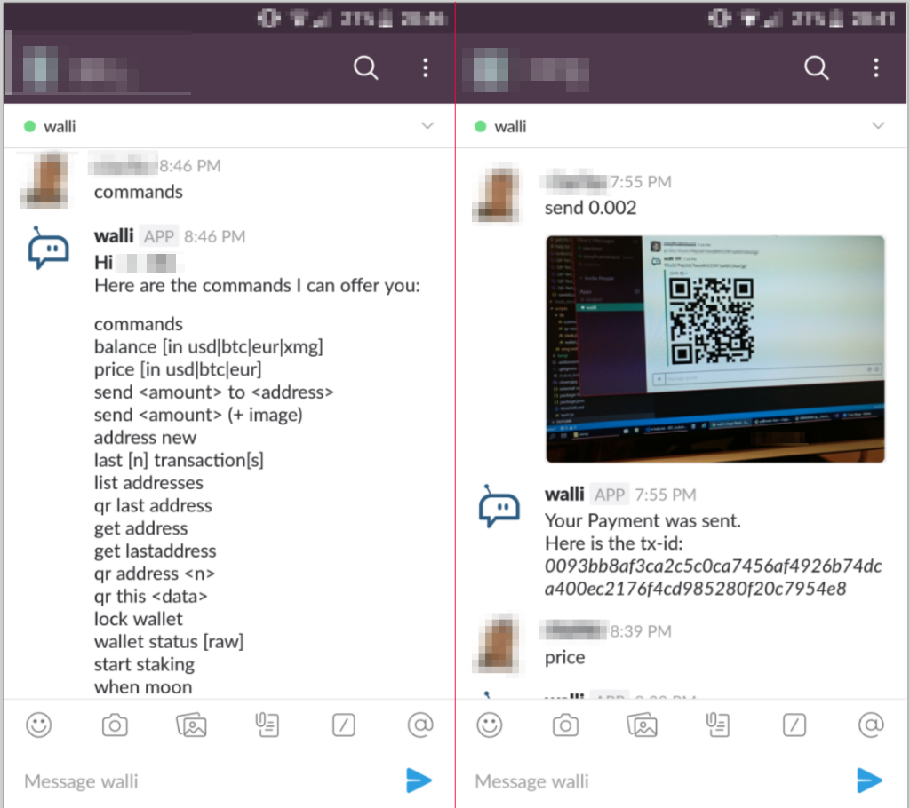

# A Hubot BOT, that can manage your XMG Wallet
## Versionnumber 1.0.0 (2018-09-23)
### _(Documentation last update 2018-09-23 14:00 CET)_  
#### _Keywords: #hubot, #hubot-script, #xmg, #wallet, #slack, #coinmarketcap, #javascript_  

A small Hubot Bot, that can be run on an Raspberry PI, so that you can manage your XMG wallet from your Smartphone.  
  
_Screenshot of Slack Chat with Walli the Bot_    

***Warning:*** _This is a proof of concept, and should be only used, if you know what you are doing! I trust MY Network, Network-Security ans ISP, do you trust YOURS?_

## Features
* some XMG Wallet functions:
    * Send XMG
    * Receive XMG
    * LOCK Wallet
    * Start Staking
    * QR Addresses
    * QR send XMG To QR-Image
    * Get XMG Balance in (XMG, USD, EUR, BTC)
    * Get XMG Price in (USD, EUR, BTC)
    * Create new Addresses
    * List Addresses for account "incoming"
    * Show the last transactions

## Future Features / Roadmap
* replacing CoinMarketCap API with free CoinGecko API
* create npm package
* add mocha tests

## Known Bugs
* none

## Usage
Setup simple installation:

* setup your XMG Wallet, set/check properties, in the `magi.conf`:
    * rpcport=8232              port to connect
    * rpcallowip=<IP-ADDRESS>   IP or IP-Range that is allowed to connect to the wallet
    * rpcuser=USERNAME          Username used to authenticate
    * rpcpassword=PASSWORD      Password used to authenticate
* ***optional:*** *set the Wallet RPC-JSON Rest to allow SSL*
* create a CoinmarketCap API Key [Link to CoinmarketCap API Documentation](https://coinmarketcap.com/api/)
* just configure create a Slack-Team-Room
* create a new Bot [Link to Slack API Documentation](https://api.slack.com/bot-users)
* clone the Repository: `git clone git@github.com:sexyfruehstueck/hubot-xmg-wallet.git`
* configure the `package.json` of the project, and Enter the needed Data
    * the *HUBOT_SLACK_TOKEN* from the earlier create Slack-Bot-Token
    * API Key for the CoinmarketCap API
    * Wallet Username
    * Wallet Password
    * Wallet IP-Addresse _(And Port if it was changed)_
    * Wallet unlock Passphrase
    * Users that should be allowed to issue commands to the bot
* install npm packages `npm install`
* run start the bot `npm start`
* ***optional:*** *configure the bot as service*

## SourceControl Link & Information
Link to the GitHub Repository  
* https://github.com/sexyfruehstueck/hubot-xmg-wallet.git
* [git@github.com:sexyfruehstueck/hubot-xmg-wallet.git](git@github.com:sexyfruehstueck/hubot-xmg-wallet.git)

## Documentation

### File / Folder Structure

    +-+ readme             // -> Folder for screenshots in readme-file
    +-+ scripts           
    | +-+ lib   
    | | +- coinmarketcap.js
    | | +- qr-reader.js
    | | +- slack.js
    | | +- wallet.js
    | +- xmg-wallet.js
    +-+ temp                // temp folder form QR Images 
    +-- .gitignore
    +-- package.json        // configuration has to be added
    +-- readme.md           // this document
    +-- LICENSE             // WTFPL
